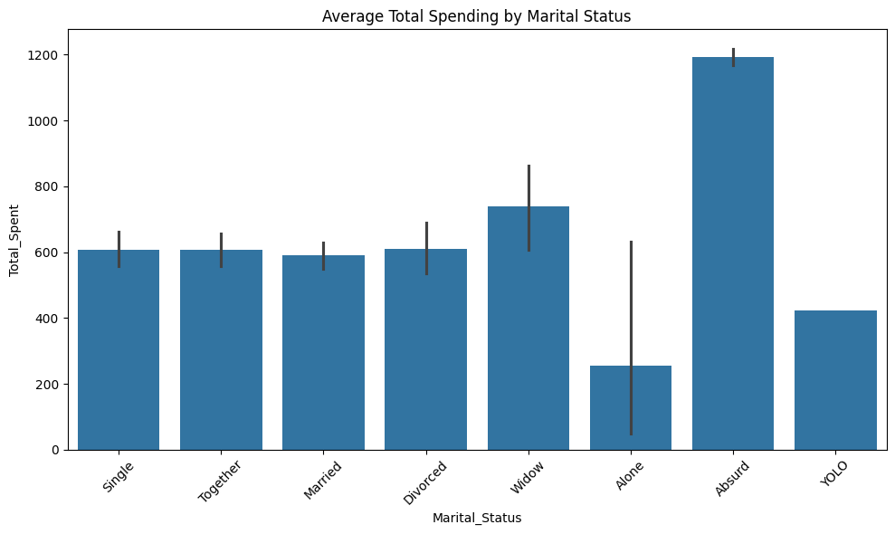
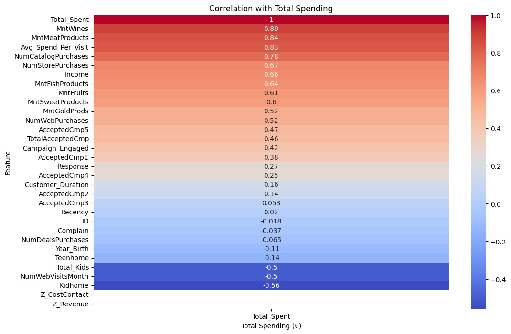
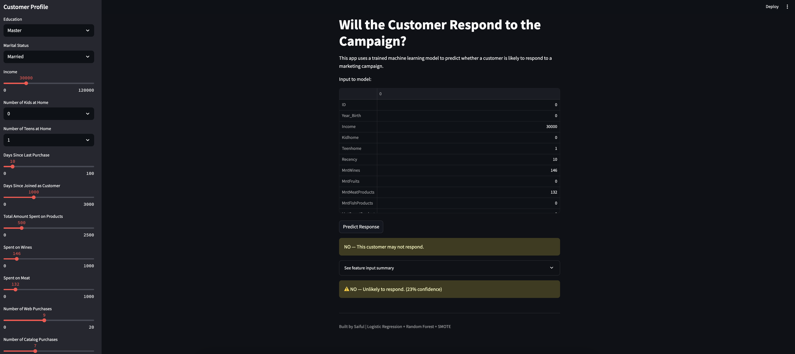
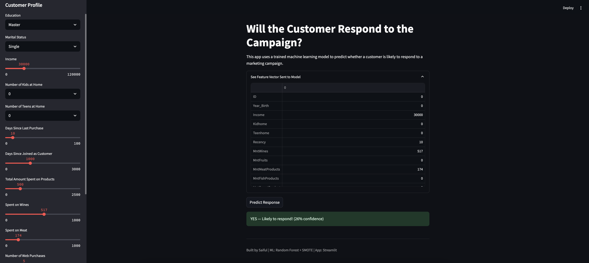
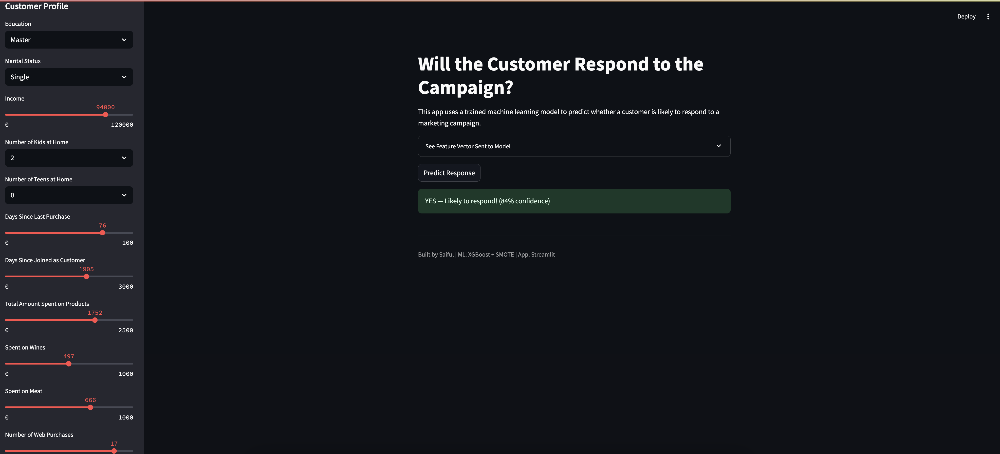

# Marketing Campaign Response Prediction: An End-to-End Data Science Project

In this project, I built a complete marketing analytics solution from scratch which simulates how a real product-based company might use data to predict customer response to campaigns.
It covers the entire data science lifecycle: from raw data cleaning and feature engineering to dashboard creation, model training, and deploying a live prediction app.

---

## Project Objective

**Predict whether a customer will respond to a marketing campaign (`Response = 1 or 0`)**

This simulates real-world marketing targeting strategies using customer demographics, spending behavior, and campaign interactions.

---

## Key Highlights

- Sourced customer marketing data from the [Kaggle Dataset](https://www.kaggle.com/datasets/rodsaldanha/arketing-campaign)
- Cleaned real-world customer data with missing values and domain-specific features
- Built an **ETL pipeline** using Python modules
- Created Superset & Streamlit dashboards for insights and interaction
- Handled class imbalance with SMOTE and tuned prediction thresholds
- Trained ML models (Logistic Regression, Random Forest, XGBoost) to predict campaign response
- Deployed a **Streamlit web app** for live predictions

---

## Project Structure

```
marketing-analytics-dashboard/
├── data/
│   ├── raw/                                # Original dataset
│   │   └── marketing_campaign.csv
│   └── processed/                          # Cleaned dataset used for modeling
│       └── marketing_campaign_cleaned.csv
│
├── notebooks/                              # Jupyter notebooks for EDA and modeling
│   ├── 1_eda_marketing_campaign.ipynb      # Initial data exploration
│   ├── eda_visualizations.ipynb            # Python-based visualizations
│   ├── model_response_prediction.ipynb     # Baseline models (LogReg, RF)
│   ├── 05_XGBmodel_response_prediction.ipynb # SMOTE + XGBoost modeling
│   └── 06_xgboost_model.ipynb              # Final tuned XGBoost model
│
├── dashboards/
│   └── screenshots/                        # Superset & Streamlit visual outputs
│       ├── income_distribution.png
│       ├── spending_by_marital.png
│       ├── spending_correlation_heatmap.png
│       ├── marketing-analytics-overview.jpg
│       ├── streamlit_marketing_dashboard_1.png
│       ├── streamlit_marketing_dashboard_2.png
│       ├── streamlit_marketing_dashboard_3.png
│       ├── streamlit_baseline_output.png
│       ├── SMOTE_XGBoost_st_baseline.png
│       ├── no_respond_baseline.png
│       └── prediction_highest_confidence.png
│
├── models/                                 # Saved models and metadata
│   ├── marketing_response_model.pkl        # Random Forest + SMOTE (baseline)
│   ├── xgboost_response_model.pkl          # Tuned XGBoost model
│   └── feature_columns.json                # Feature list for Streamlit prediction
│
├── src/                                    # Python scripts for ETL and modeling
│   ├── extract.py                          # Load raw data
│   ├── transform.py                        # Feature engineering and cleaning
│   ├── load.py                             # Save into DuckDB
│   ├── run_pipeline.py                     # Full ETL pipeline trigger
│   └── save_model.py                       # Train and save model (.pkl)
│
├── streamlit/                              # Streamlit web apps
│   ├── streamlit_initial_dashboard.py      # Baseline response dashboard
│   └── streamlit_final_dashboard.py        # Final prediction dashboard (XGBoost)
│
├── superset_duck.db                        # Apache Superset metadata DB
├── requirements.txt                        # Project dependencies
├── README.md                               # Project documentation (you're reading it!)
└── venv/                                   # Python virtual environment (not tracked)
```
---

## EDA Visualizations (Python)

### 1. Spending by Marital Status
**Who spends more on average?**



---

### 2. Income Distribution
**Are there income gaps or outliers?**


---

### 3. Correlation Heatmap
**What features correlate with total spending?**



---

## Dashboards

### Apache Superset (Exploratory Analytics)
- Total spend by education
- Customer acquisition trend
- Campaign response rate


### Streamlit App (Prediction & Interactivity)
```bash
# Run the app
source venv/bin/activate
streamlit run streamlit_final_dashboard.py
```

- Customer profile input
- Shows predicted likelihood of campaign response
- Visualizes full feature vector

### Baseline Prediction:


### Baseline Prediction (Before XGBoost):


### Prediction with High Confidence:


---

## ML Modeling Strategy

### Models Trained
- Logistic Regression (Baseline)
- Random Forest (Better accuracy)
- XGBoost (Final choosen, with improved performance)

### Addressing Class Imbalance
- Used SMOTE to oversample responders (class 1)
- Improved recall from 30% → 57%

| Model | Accuracy | Precision (1) | Recall (1) | F1-score (1) |
|-------|----------|---------------|------------|--------------|
| Logistic Regression | 73% | 0.32 | 0.72 | 0.44 |
| Random Forest + SMOTE | 88% | 0.61 | 0.57 | 0.59 |
| XGBoost + SMOTE | 89% | 0.65 | 0.61 | 0.63 |

### Key Learnings
> Our model learned to detect **non-responders** better than responders, even after SMOTE.  
> This highlights **class imbalance, limited positive samples**, and possible **model conservativeness**.  
> We tuned thresholds and used richer features to help improve predictions.

---

## Model Deployment

### Model Saved as Pickle
```bash
python src/save_model.py
```
This saves:
- `xgboost_response_model.pkl`
- `feature_columns.json` for input alignment

### Streamlit App: Live Prediction
- Full input profile → Feature vector → Model inference
- Confidence score and prediction output
- Custom threshold (e.g., 0.25) to tune positive predictions


---

## Reproducibility – How to Run Locally

```bash
git clone https://github.com/saifar-tug/marketing-analytics-dashboard.git
cd marketing-analytics-dashboard

python3 -m venv venv
source venv/bin/activate
pip install -r requirements.txt

# Run ETL pipeline
python src/run_pipeline.py

# Train and save model
python src/save_model.py

# Run Streamlit App
streamlit run streamlit_final_dashboard.py
```

---

## Challenges Faced

- Missing values in `Income` required group-wise imputation
- Class imbalance made it hard to predict responders
- Feature alignment between Streamlit and model input
- Models were conservative; required threshold tuning
- Superset schema registration was unintuitive

---

## Summary

> In this project I tried to showcase an end-to-end **marketing data analytics pipeline**, combined **data engineering**, **exploratory analysis**, **machine learning**, and **dashboard development**.

Aiming for roles in:
- Data Science
- Marketing Analytics
- MLOps / Streamlit App Development